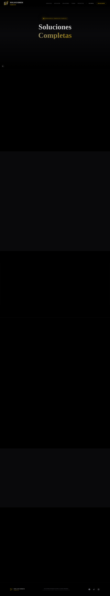

# Fabrick — Soluciones Integrales de Construcción y Remodelación

> Plataforma e-commerce y de servicios para Fabrick Chile. Construida con Next.js 15, React 18 y Tailwind CSS.

## 🔗 Ver el sitio en vivo

**➡️ [https://solucionfabrick2-5.vercel.app](https://solucionfabrick2-5.vercel.app)**

---

## 🖼️ Preview

### Página principal



### Tienda


---

## Stack

- **Next.js 15** (Turbopack)
- **React 18**
- **Tailwind CSS 3.4**
- **TypeScript 5**
- **InsForge SDK** (base de datos, auth, storage)

## Estructura

```
src/
├── app/              # App Router pages
│   ├── page.tsx      # Landing principal
│   ├── tienda/       # Tienda online
│   ├── soluciones/   # Servicios
│   ├── checkout/     # Pago
│   ├── admin/        # Panel de administración
│   └── auth/         # Autenticación
├── components/       # Componentes reutilizables
├── context/          # Contextos (Theme, Auth)
└── lib/              # Utilidades y cliente InsForge
```

## Desarrollo local

```bash
npm install
npm run dev
```

Abre [http://localhost:3000](http://localhost:3000) en tu navegador.

## Deploy

El deploy se hace automáticamente a Vercel:
- **Push a `main`** → deploy a producción
- **Pull Request** → deploy de preview
