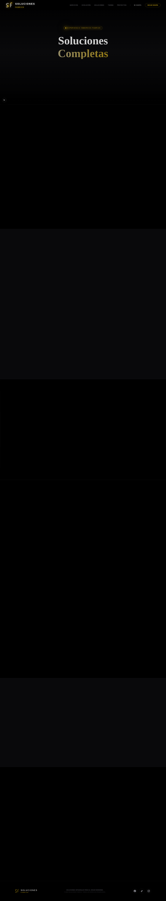
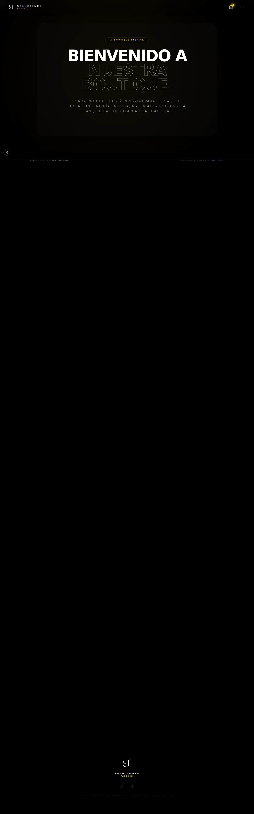

# Fabrick — Soluciones Integrales de Construcción y Remodelación

> Plataforma e-commerce y de servicios para Fabrick Chile. Construida con Next.js 15, React 18 y Tailwind CSS.

## 🔗 Ver el sitio en vivo

**➡️ [https://solucionfabrick2-5.vercel.app](https://solucionfabrick2-5.vercel.app)**

---

## 🖼️ Preview

### Página principal



### Tienda



---

## Stack

- **Next.js 15.5** (App Router)
- **React 19**
- **TypeScript 5**
- **Tailwind CSS 3.4** (no actualizar a v4 — está bloqueado en `package.json`)
- **InsForge SDK** (PostgreSQL vía PostgREST + Auth + Storage)
- **Mercado Pago** para pagos · **Resend** / Nodemailer para email · **Cloudinary** opcional para media
- **Sentry** + **Vercel Analytics** para observabilidad
- Pruebas: **Vitest** (unit, con `@vitest/coverage-v8`) + **Playwright** (E2E)

## Estructura

```
src/
├── app/              # App Router (78 páginas, 84 endpoints)
│   ├── page.tsx      # Landing principal
│   ├── tienda/       # Tienda online
│   ├── soluciones/   # Servicios
│   ├── checkout/     # Pago
│   ├── admin/        # Panel de administración (30 módulos)
│   ├── auth/         # Autenticación
│   └── api/          # Endpoints API
├── components/       # Componentes reutilizables
├── context/          # Contextos (Theme, Auth)
└── lib/              # Utilidades y clientes (51 helpers)
tests/                # Vitest unit + Playwright E2E
docs/                 # Documentación técnica
scripts/              # CLIs ops (admin password, TOTP, backup codes)
```

Para un mapa detallado de qué módulos viven en `main` y cuáles aún no, ver [`docs/inventory.md`](./docs/inventory.md).

## Desarrollo local

```bash
npm install
cp .env.example .env.local   # luego rellena las claves
npm run dev
```

Abre [http://localhost:3000](http://localhost:3000) en tu navegador.

## Scripts disponibles

```bash
npm run dev                          # Next dev server
npm run build                        # Build de producción
npm run start                        # Start del build
npm run lint                         # ESLint (next lint)
npm run typecheck                    # tsc --noEmit
npm run test                         # Vitest run
npm run test:watch                   # Vitest watch
npm run test:coverage                # Vitest + coverage v8
npm run test:e2e                     # Playwright
npm run test:e2e:ui                  # Playwright en modo UI

# CLIs operativas (admin)
npm run admin:set-password           # Setear / rotar password local del admin
npm run admin:enable-totp            # Habilitar TOTP 2FA
npm run admin:disable-totp           # Deshabilitar TOTP 2FA
npm run admin:generate-backup-codes  # Generar 10 códigos de respaldo
```

## Documentación

- [Guía de contribución](./CONTRIBUTING.md)
- [Changelog](./CHANGELOG.md)
- [Inventario de módulos en `main`](./docs/inventory.md)
- [Modo privado y seguridad del admin](./docs/security-private-mode.md)
- [CMS universal](./docs/cms-universal.md) · [Performance runtime](./docs/perf-runtime.md)
- [Push notifications](./docs/push-notifications.md) · [Comparaciones](./docs/comparaciones.md)
- [InsForge + edge functions e-commerce](./docs/insforge-edge-functions-ecommerce.md)

## Deploy

El deploy se hace automáticamente a Vercel:
- **Push a `main`** → deploy a producción
- **Pull Request** → deploy de preview (los E2E corren contra ese preview)

## Reportar bugs / vulnerabilidades

- Bugs y mejoras: usa los [templates de issue](./.github/ISSUE_TEMPLATE/).
- Vulnerabilidades **explotables**: NO abras issue público. Usa el [GitHub Security Advisory privado](https://github.com/thinkfashz/solucionfabrick2.5/security/advisories/new) o contacta al maintainer en [`CODEOWNERS`](./.github/CODEOWNERS).
